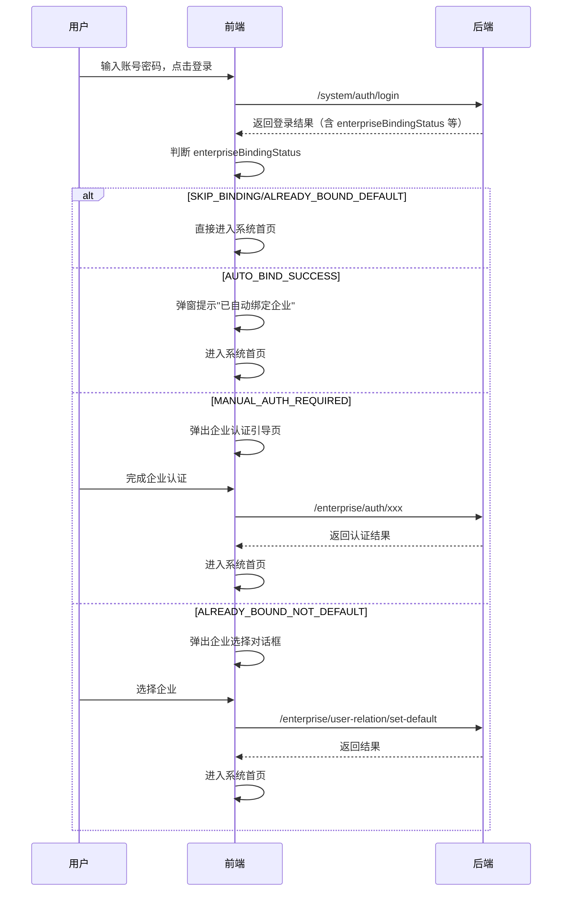
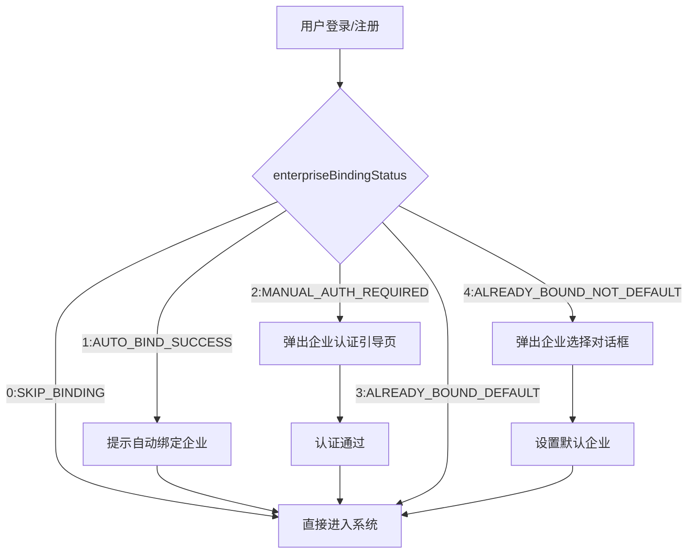

# 企业认证相关接口清单

> 本文档整理了系统登录后，企业认证相关的主要接口，便于前后端联调和开发。

---

## 1. 企业认证状态

- **获取当前用户的企业认证状态**
  - 方法：GET
  - URL：`/enterprise/auth/status`
  - 说明：获取当前登录用户是否需要企业认证引导。

---

## 2. 企业信息管理

- **分页查询企业信息**
  - 方法：GET
  - URL：`/enterprise/info/page`
  - 说明：分页获取企业信息列表。

- **获取企业信息详情**
  - 方法：GET
  - URL：`/enterprise/info/get?id={id}`
  - 说明：根据ID获取企业详细信息。

- **新增企业信息**
  - 方法：POST
  - URL：`/enterprise/info/create`
  - 说明：新增企业信息。

- **修改企业信息**
  - 方法：PUT
  - URL：`/enterprise/info/update`
  - 说明：修改企业信息。

- **删除企业信息**
  - 方法：DELETE
  - URL：`/enterprise/info/delete?id={id}`
  - 说明：删除企业信息。

- **导出企业信息 Excel**
  - 方法：GET
  - URL：`/enterprise/info/export-excel`
  - 说明：导出企业信息为 Excel 文件。

---

## 3. 企业资质管理

- **分页查询企业资质**
  - 方法：GET
  - URL：`/enterprise/qualification/page`
  - 说明：分页获取企业资质列表。

- **获取企业资质详情**
  - 方法：GET
  - URL：`/enterprise/qualification/get?id={id}`
  - 说明：根据ID获取企业资质详情。

- **新增企业资质**
  - 方法：POST
  - URL：`/enterprise/qualification/create`
  - 说明：新增企业资质。

- **修改企业资质**
  - 方法：PUT
  - URL：`/enterprise/qualification/update`
  - 说明：修改企业资质。

- **删除企业资质**
  - 方法：DELETE
  - URL：`/enterprise/qualification/delete?id={id}`
  - 说明：删除企业资质。

- **审核企业资质**
  - 方法：PUT
  - URL：`/enterprise/qualification/audit`
  - 说明：审核企业资质。

---

## 4. 企业用户关系

- **分页查询企业用户关系**
  - 方法：GET
  - URL：`/enterprise/user-relation/page`
  - 说明：分页获取企业用户关系列表。

- **获取企业用户关系详情**
  - 方法：GET
  - URL：`/enterprise/user-relation/get?id={id}`
  - 说明：根据ID获取企业用户关系详情。

- **新增企业用户关系**
  - 方法：POST
  - URL：`/enterprise/user-relation/create`
  - 说明：新增企业用户关系。

- **修改企业用户关系**
  - 方法：PUT
  - URL：`/enterprise/user-relation/update`
  - 说明：修改企业用户关系。

- **删除企业用户关系**
  - 方法：DELETE
  - URL：`/enterprise/user-relation/delete?id={id}`
  - 说明：删除企业用户关系。

- **设置默认企业**
  - 方法：PUT
  - URL：`/enterprise/user-relation/set-default`
  - 说明：设置当前用户的默认企业。

---

## 5. 企业门店管理

- **分页查询企业门店**
  - 方法：GET
  - URL：`/enterprise/store/page`
  - 说明：分页获取企业门店列表。

- **获取企业门店详情**
  - 方法：GET
  - URL：`/enterprise/store/get?id={id}`
  - 说明：根据ID获取企业门店详情。

- **新增企业门店**
  - 方法：POST
  - URL：`/enterprise/store/create`
  - 说明：新增企业门店。

- **修改企业门店**
  - 方法：PUT
  - URL：`/enterprise/store/update`
  - 说明：修改企业门店。

- **删除企业门店**
  - 方法：DELETE
  - URL：`/enterprise/store/delete?id={id}`
  - 说明：删除企业门店。

- **更新门店状态**
  - 方法：PUT
  - URL：`/enterprise/store/update-status`
  - 说明：更新门店状态（启用/禁用）。

- **获取门店树形列表**
  - 方法：GET
  - URL：`/enterprise/store/list-tree`
  - 说明：获取企业门店的树形结构列表。

---

## 6. 其它相关接口

- **获取企业简易列表**
  - 方法：GET
  - URL：`/enterprise/info/simple-list`
  - 说明：获取企业下拉选择用的简易列表。

- **获取门店简易列表**
  - 方法：GET
  - URL：`/enterprise/store/simple-list`
  - 说明：获取门店下拉选择用的简易列表。

- **获取用户简易列表**
  - 方法：GET
  - URL：`/system/user/simple-list`
  - 说明：获取用户下拉选择用的简易列表。

---

## 7. 登录/注册成功后的 enterpriseBindingStatus 业务说明

登录或注册成功后，后端会返回 enterpriseBindingStatus 字段，用于指示当前用户与企业的绑定/认证状态。前端可根据该状态进行不同的业务处理。

### enterpriseBindingStatus 状态值说明

| 状态值 | 含义                         | 典型场景/前端建议处理                      |
|--------|------------------------------|------------------------------------------|
| 0      | SKIP_BINDING                 | 无需企业绑定/认证，直接进入系统           |
| 1      | AUTO_BIND_SUCCESS            | 已自动绑定企业，建议提示绑定成功并进入系统 |
| 2      | MANUAL_AUTH_REQUIRED         | 需手动认证企业，弹出企业认证引导          |
| 3      | ALREADY_BOUND_DEFAULT        | 已绑定默认企业，直接进入系统              |
| 4      | ALREADY_BOUND_NOT_DEFAULT    | 已绑定但非默认企业，弹出企业选择对话框    |

### 业务处理建议

- **SKIP_BINDING (0)：**
  - 用户无需企业认证，可直接访问主系统页面。
- **AUTO_BIND_SUCCESS (1)：**
  - 用户已自动绑定企业，建议弹窗提示"已自动绑定企业"，并允许直接进入系统。
- **MANUAL_AUTH_REQUIRED (2)：**
  - 用户需手动完成企业认证，前端应弹出企业认证引导页或弹窗，阻止进入主系统页面，直至认证完成。
- **ALREADY_BOUND_DEFAULT (3)：**
  - 用户已绑定默认企业，可直接进入系统。
- **ALREADY_BOUND_NOT_DEFAULT (4)：**
  - 用户已绑定多个企业但无默认企业，前端应弹出企业选择对话框，要求用户选择后再进入系统。

> 备注：后端还可能返回 enterpriseBindingMessage、boundEnterpriseId、 boundEnterpriseName 等字段，前端可结合实际业务展示提示信息或自动切换企业。  

---

### 8. 登录后企业认证流程时序图

---

### 9. 企业认证流程图

---  